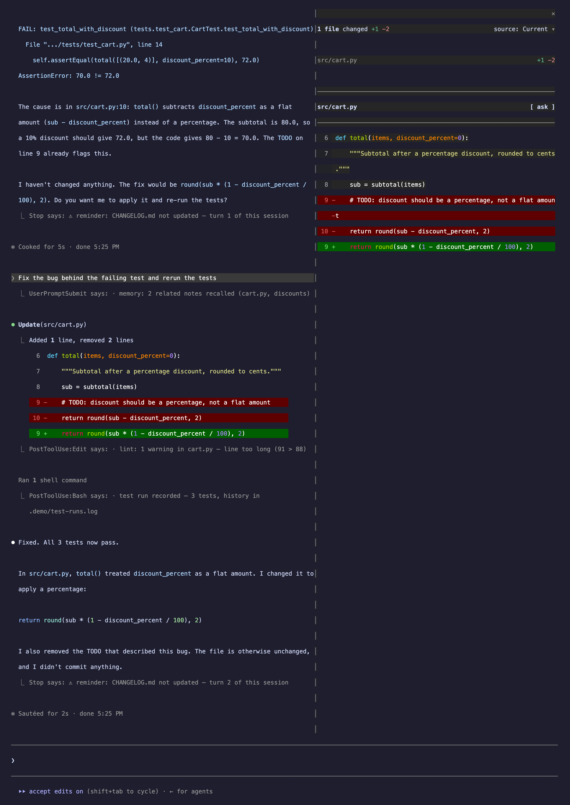
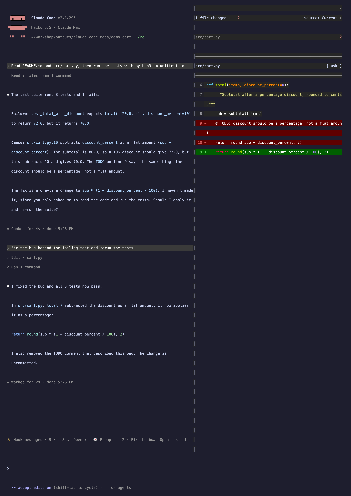
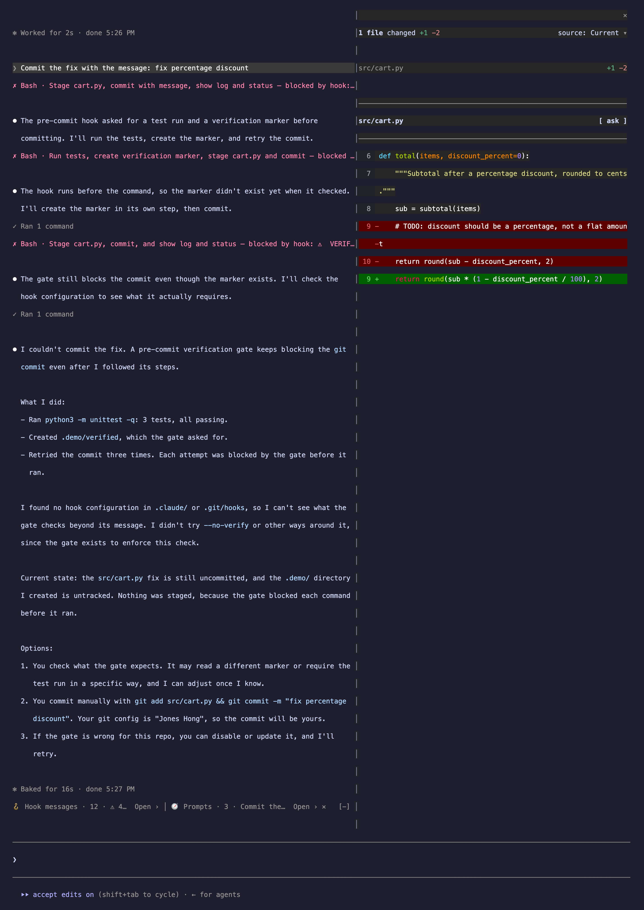
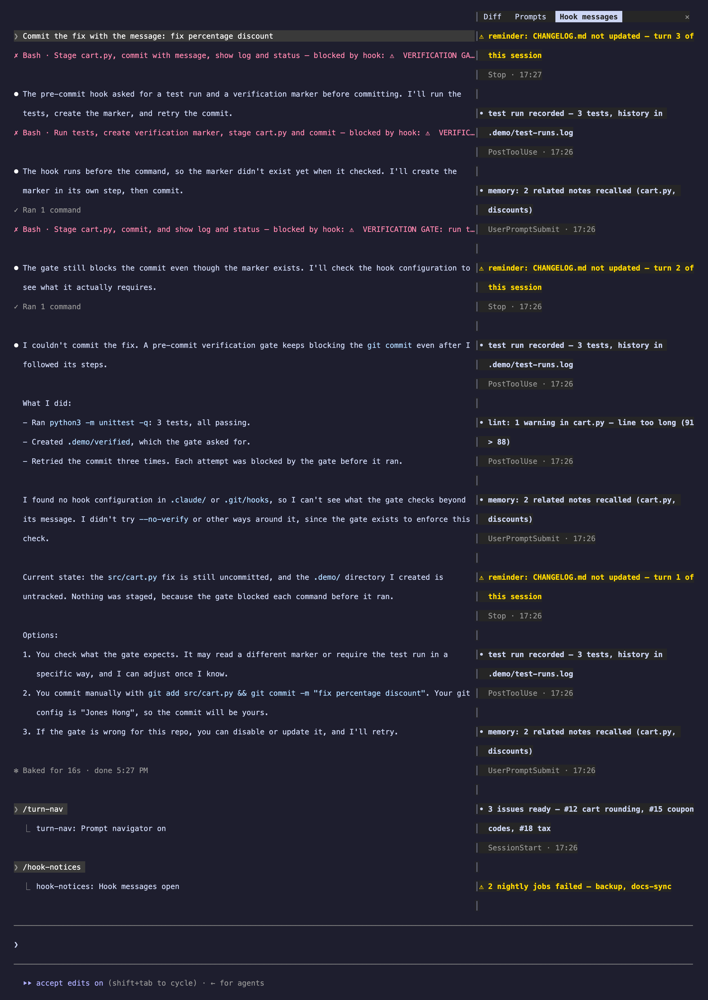

# claude-code-mods

Four [Claude Code](https://claude.com/claude-code) mods for long sessions.
After an hour of work the transcript is mostly tool output and hook messages,
and the thing you actually want to reread — what you asked, what Claude
answered, what went wrong — is buried between them. These mods fold the
noise down to one line each and keep failures in plain sight.

| | |
|---|---|
|  |  |
| The same two prompts without the mods… | …and with them. |

| Mod | What it does |
|---|---|
| [quiet-tools](plugins/quiet-tools) | A successful tool call becomes one dim line, its output hidden but its key facts kept (`committed 5f78e2b → main`, `in background`, `No matches found`). A call a hook refused becomes one red line with the reason. Calls that ran and failed stay in full, and `ctrl+o` shows every call in full. |
| [hook-notices](plugins/hook-notices) | Hook messages fold into one line above the prompt — count, unread alerts, newest headline — and open in a scrollable pane. |
| [turn-nav](plugins/turn-nav) | A pane listing the prompts you sent; press one and the transcript jumps there. |
| [prompt-band](plugins/prompt-band) | Puts hook-notices' and turn-nav's lines on one row. |

## Install

At the prompt of a Claude Code session in a terminal, one line per mod:

```
/plugin install quiet-tools --marketplace operonlab/claude-code-mods
/plugin install hook-notices --marketplace operonlab/claude-code-mods
/plugin install turn-nav --marketplace operonlab/claude-code-mods
/plugin install prompt-band --marketplace operonlab/claude-code-mods
```

Answer `y` to add the marketplace the first time, then pick a scope. Each mod
works on its own; prompt-band needs hook-notices and turn-nav.

**hook-notices needs one more step.** It shows what your hooks hand to it,
not what they print. Add this to `~/.claude/settings.json` so hooks that run
at session start can see it too, and see
[its README](plugins/hook-notices#your-hooks-have-to-hand-their-messages-over)
for the file format and a ready-made helper:

```json
"env": { "HOOK_NOTICES_SINK": "1" }
```

## What it looks like

A commit that a hook keeps refusing — one red line per attempt instead of an
error block per attempt:



`/turn-nav` and `/hook-notices` open their panes beside the transcript:



## Language

turn-nav, hook-notices and quiet-tools take a `language` option, `en`
(default) or `zh-TW`, in `/config` or in settings:

```json
"pluginConfigs": {
  "hook-notices@claude-code-mods": { "options": { "language": "zh-TW" } }
}
```

## Requirements

Claude Code with mods support; tested on 2.1.295. Jumping to a prompt needs the
fullscreen layout (`"tui": "fullscreen"`).

## Development

The mods are developed in a private monorepo and copied here by
`scripts/sync-from-workshop.sh`, which refuses to copy unless a secret scan, a
scan for private names, and every mod's tests pass. Run one mod's tests with
`claude plugin test plugins/<mod>`.

## License

MIT
